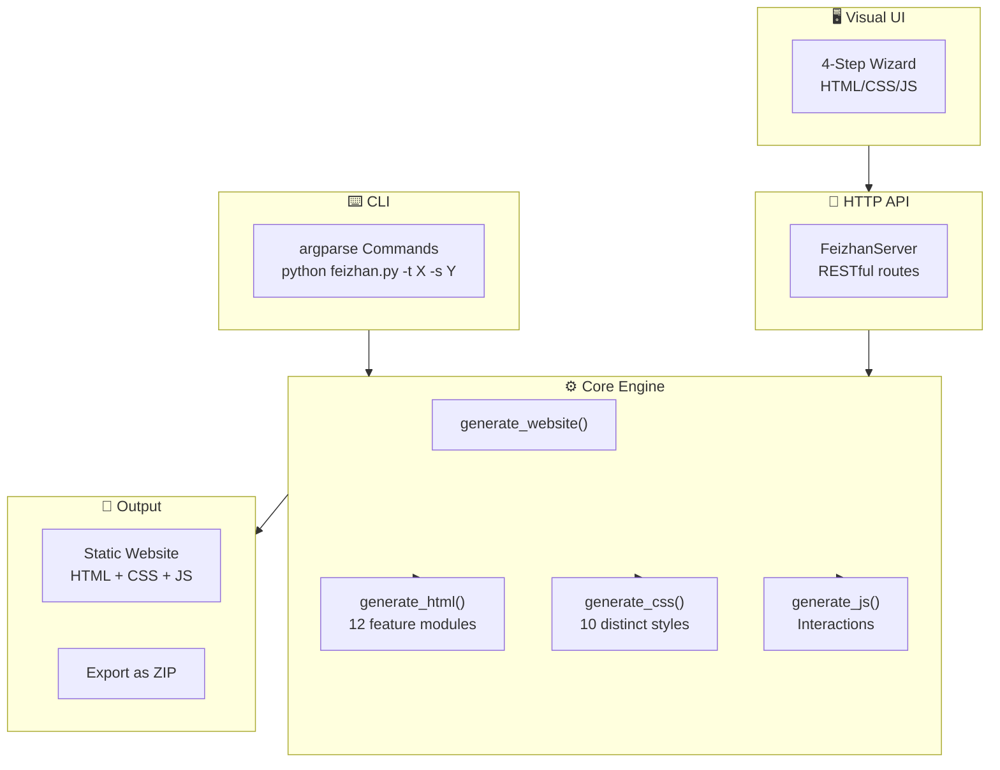

# 🛸 Feizhan (飞站) — One-Click Website Generator

> **Turn one prompt into a complete website. 5 site types × 10 CSS styles × 12 feature modules.**
> An open-source AI-powered website generator for landing pages, portfolios, blogs, and forums. Built for makers who ship fast.

[](https://github.com/luckychenxiaowen/feizhan)
[](LICENSE)
[](https://python.org)
[](https://github.com/luckychenxiaowen/feizhan/releases)

[English](#english) | [中文文档](#中文)

[🚀 Quick Start](#quick-start) · [✨ Features](#features) · [🎨 Styles](#design-styles) · [📖 Docs](docs/) · [🤝 Contributing](CONTRIBUTING.md)

[](https://star-history.com/#luckychenxiaowen/feizhan&Date)

---

## 🎬 Demo

<p align="center">
  
</p>

## ✨ Features

| Feature | Description |
|---------|-------------|
| 🎯 **Prompt-to-Website** | One prompt generates a complete site |
| 🖥️ **Visual Wizard UI** | 4-step guided builder — no code needed |
| 🏢 **5 Site Types** | Company, Product Crowdfunding, Portfolio, Blog, Forum |
| 🎨 **10 CSS Styles** | Modern, Minimal, Bento, Brutalist, Glass, Neumorphic, Gradient, Dark, Cyber, Nature |
| 📦 **12 Feature Modules** | Hero, About, Products, Portfolio, Case Studies, Pricing, Contact, Articles, Categories, Topics, User Center, Live Chat |
| 📐 **1-3 Level Depth** | Single-page, standard, or full site structure |
| 📜 **History & Regenerate** | Keep all versions, regenerate with one click |
| 🔌 **API + CLI** | Use via HTTP API, CLI commands, or visual UI |
| 💾 **Code Export** | One-click export source code as ZIP |

## 🚀 Quick Start

> ⚡ **30 seconds to your first website.**

### Prerequisites
- Python 3.10+

### Install & Run

```bash
# Clone the repo
git clone https://github.com/luckychenxiaowen/feizhan.git
cd feizhan/飞站skill

# Install dependencies (stdlib only — zero external deps!)
# No pip install needed!

# Start the visual UI
python feizhan.py --ui

# Or generate via CLI
python feizhan.py -t company -s modern -p 2
```

> 🎉 **Done!** Open http://localhost:8765 to use the visual builder.

### CLI Examples

```bash
# Company website with modern style, 2-level depth
python feizhan.py -t company -s modern -p 2

# Portfolio with glass-morphism, single page
python feizhan.py -t portfolio -s glass -p 1

# Product crowdfunding with cyberpunk style, 3 levels
python feizhan.py -t product -s cyber -p 3

# Blog with dark mode, 2 levels, custom features
python feizhan.py -t blog -s dark -p 2 -f article category about contact
```

## 🎨 Design Styles

| # | Style | Effect | Best For |
|---|-------|--------|----------|
| 1 | **Modern (现代简约)** | Clean gradients, soft shadows | Corporate, SaaS |
| 2 | **Minimal (极简主义)** | Large whitespace, minimal borders | Designers, photographers |
| 3 | **Bento (卡片网格)** | Rounded cards, grid layout, hover animations | Portfolios, dashboards |
| 4 | **Brutalist (粗犷野性)** | Thick borders, sharp angles, bold typography | Creative agencies, artists |
| 5 | **Glass (毛玻璃)** | Frosted glass blur, semi-transparent, modern tech | Tech companies, startups |
| 6 | **Neumorphic (柔光拟态)** | Soft shadows, 3D convex/concave, tactile feel | Luxury brands, UI tools |
| 7 | **Gradient (渐变色彩)** | Multi-color gradients, flowing colors | Consumer apps, creative |
| 8 | **Dark (暗黑模式)** | Deep backgrounds, high contrast, eye-friendly | Developer tools, gaming |
| 9 | **Cyber (赛博朋克)** | Neon glow, scan lines, futuristic | Gaming, crypto, tech art |
| 10 | **Nature (自然清新)** | Natural greens, soft curves, organic | Wellness, eco brands |

## 🏗️ Architecture



## 📁 Project Structure

```
飞站skill/
├── feizhan.py              # Main engine + HTTP server
├── src/
│   ├── ui/                 # Visual builder (HTML/CSS/JS)
│   │   ├── index.html      # 4-step wizard interface
│   │   ├── style.css       # UI styling
│   │   └── app.js          # Interactive logic
│   ├── core/               # Constants & config
│   ├── templates/          # CSS style templates
│   └── generators/         # Future: prompt-based generators
├── outputs/                # Generated websites
├── docs/                   # Documentation
├── assets/                 # Screenshots & assets
├── README.md
├── CONTRIBUTING.md
├── CHANGELOG.md
└── LICENSE
```

## 🤝 Contributing

We welcome contributions! See [CONTRIBUTING.md](CONTRIBUTING.md) for details.

### Quick contribution flow:
1. Fork the repo
2. Create a feature branch: `git checkout -b feature/amazing-feature`
3. Commit your changes: `git commit -m 'feat: add amazing feature'`
4. Push and open a PR

> We follow [Conventional Commits](https://www.conventionalcommits.org/) and respond to all PRs within 48 hours.

## 📄 License

MIT © [Your Name](https://github.com/luckychenxiaowen)

---

# 中文

## 🛸 飞站 — 一键网站生成器

> **一个提示词，生成一个完整网站。5种类型 × 10种风格 × 12个功能模块。**

飞站是一个开源的AI驱动网站生成器，只需选择类型、风格和功能，几秒即可生成完整的企业官网、产品众筹页、个人作品集、博客或论坛网站。

### ⚡ 30秒上手

```bash
git clone https://github.com/luckychenxiaowen/feizhan.git
cd feizhan/飞站skill
python feizhan.py --ui
# 浏览器打开 http://localhost:8765
```

### 🎯 核心亮点

- **一句话生成**：输入prompt即可生成
- **可视化向导**：4步选择 → 类型 → 风格 → 功能 → 一键生成
- **纯Python实现**：零外部依赖，即装即用
- **完整开源**：MIT协议，自由使用和修改

### 📊 支持矩阵

| 维度 | 选项 |
|------|------|
| 网站类型 | 公司官网 / 产品众筹 / 作品集 / 博客 / 论坛 |
| 设计风格 | 现代简约 / 极简 / 卡片网格 / 粗犷 / 毛玻璃 / 柔光 / 渐变 / 暗黑 / 赛博 / 自然 |
| 功能模块 | 公司介绍 / 产品服务 / 作品展示 / 案例 / 定价 / 联系 / 文章 / 分类 / 话题 / 用户 / 咨询 等12项 |
| 层级深度 | 1层(单页) / 2层(标准) / 3层(完整) |

---

<p align="center">
  Made with ❤️ by the Feizhan Team | 
  <a href="https://github.com/luckychenxiaowen/feizhan">⭐ Star us on GitHub!</a>
</p>